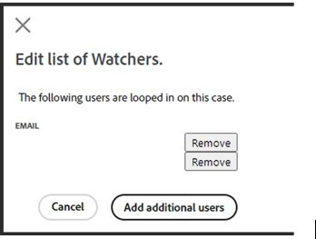

# Guía del usuario del Centro de ayuda de Adobe Commerce

En esta guía, aprenderá a enviar un ticket de asistencia a [Centro de ayuda de Adobe Commerce](https://support.magento.com/hc/en-us) y proporcionan acceso compartido a las cuentas de Adobe Commerce.

>[!NOTE]
>
>La asistencia de Adobe Commerce se está trasladando del Centro de ayuda de Adobe Commerce al Experience League. Si se le ha notificado que tiene acceso, utilice el flujo de formulario de casos de Experience League descrito [aquí](#what-is-experience-support). Si no se le ha notificado, siga utilizando la variable [Flujo del caso del Centro de ayuda de Adobe Commerce](#what-is-adobe-commerce-help-center).

>[!NOTE]
>
>La parte de Knowledge Base del Centro de ayuda de Adobe Commerce ha migrado al portal de Adobe Experience League. Cuando cree un vale de soporte, se le sugerirán artículos de la Base de conocimiento relacionados, junto con otra documentación de Adobe Commerce relevante de Adobe Experience League.

**Actualización principal:** 8 de julio de 2024

**[¿QUÉ ES LA ASISTENCIA DEL EXPERIENCE LEAGUE?](#what-is-experience-support)**

**[CASOS DE SOPORTE](#support-cases)**

* [Iniciar sesión en Soporte para Experience League](#sign-in-experience-support)
* [Envío de un caso de asistencia](#submit-case)

   * [Página de inicio de Adobe Experience League](#experience-league-start-page)
   * [página de cuenta de Adobe Commerce](#submit-case-adobe-commerce-account-page)
   * [*Verifique su dirección de correo electrónico*](#verify-email-address-error)

* [Seguimiento de los casos de asistencia](#track-support-cases)
* [Comentarios en su caso](#comments-in-your-case)
* [Cierre su caso](#close-case)

**[¿QUÉ ES EL CENTRO DE AYUDA DE ADOBE COMMERCE?](#what-is-adobe-commerce-help-center)**

**[TICKETS DE ASISTENCIA](#support-tickets)**

* [Iniciar Sesión En El Centro De Ayuda](#login)
* [Enviar un ticket de asistencia](#submit-ticket)

   * [Página de inicio del Centro de ayuda](#submit-ticket-help-center-start-page)
   * [Página Cuenta de Magento](#submit-ticket-magento-account-page)
   * [Consola de nube](#submit-ticket-magento-cloud-account-page)
   * [Información en su ticket de asistencia](#info-in-support-ticket)
   * [El vínculo &quot;Enviar un ticket&quot; no se muestra en la página de inicio del Centro de ayuda de Adobe Commerce](#no-submit-link)
   * [*&quot;Verifique su dirección de correo electrónico&quot;*](#verify-email-address)
   * [Formulario de envío de tickets: el comerciante no se muestra en la lista desplegable Organización](#merchant-not-displayed)

* [Rastree sus tickets](#track-tickets)
* [Línea directa de Adobe Commerce P1 (se requiere inicio de sesión)](#P1-hotline)
* [Modelo operativo de responsabilidad compartida de Adobe Commerce (se requiere inicio de sesión)](#shared-responsibility-operational-model)
* [Campos de ticket de asistencia explicados](#ticket-fields-explained)
* [Estado del vale: Cómo se procesan las solicitudes](#ticket-status)
* [Conversación en su ticket](#conversation-in-ticket)
* [Resuelva su solicitud](#resolve-ticket)
* [Abra un ticket de seguimiento](#follow-up)

**[ACCESO COMPARTIDO: CONCEDA PRIVILEGIOS PARA QUE OTROS USUARIOS ACCEDAN A SU CUENTA](#shared-access)**

* [Quién puede proporcionar acceso compartido](#who-can-provide-shared-access)
* [Proporcionar acceso compartido](#provide-shared-access)
* [Revocar (eliminar) el acceso compartido](#revoke-shared-access)

   * [¿Cómo eliminar a los usuarios a los que se les concedió acceso compartido a través de un proyecto de Cloud?](#remove-cloud-shared-access-users)

* [Acceso a una cuenta compartida (cuentas de conmutador)](#switch-accounts)
* [Solución de problemas de acceso compartido](#troubleshooting-shared-access)

**[PREGUNTAS FRECUENTES SOBRE FACTURACIÓN PARA ADOBE COMMERCE](#billing-faq)**

**[MAGENTO U AHORA FORMA PARTE DE LOS SERVICIOS DE APRENDIZAJE DIGITAL DE ADOBE](#magento-u)**

>[!NOTE]
>
>A menos que se le haya notificado, continúe utilizando el [Flujo del caso del Centro de ayuda de Adobe Commerce](#what-is-adobe-commerce-help-center). Si se le ha notificado que está en la cohorte con acceso, siga el flujo de formulario de casos de Experience League descrito [abajo](#what-is-experience-league-support).

## ¿QUÉ ES LA ASISTENCIA DEL EXPERIENCE LEAGUE? {#what-is-experience-support}

Asistencia al Experience League es un portal de asistencia para el Adobe en el que los clientes de Adobe Commerce aptos pueden enviar y administrar vales de soporte. También es donde puede revisar los artículos de resolución de problemas.

## CASOS DE SOPORTE {#support-cases}

La administración de casos de soporte de Adobe Experience League permite trabajar con el soporte a través de casos para abordar problemas específicos encontrados al utilizar productos de Adobe, incluido Adobe Commerce, para todos los productos de Adobe Commerce bajo contrato.

## INICIAR SESIÓN EN ASISTENCIA PARA EXPERIENCE LEAGUE {#sign-in-experience-support}

El inicio de sesión le permite enviar, actualizar y responder a preguntas de los agentes en vales de soporte.

Para iniciar sesión en Soporte de Adobe Experience League, siga estos pasos:

1. Vaya a [experienceleague.adobe.com](https://experienceleague.adobe.com/).
1. Inicie sesión con sus credenciales de inicio de sesión de Adobe.

### Envío de un caso de asistencia {#support-case}

Una vez que haya iniciado sesión correctamente, puede enviar un caso de asistencia mediante la página de inicio de Adobe Experience League, la página de la cuenta de Adobe Commerce y la página de la cuenta de Adobe Commerce Cloud.

* Si usted es el propietario de la cuenta, siga los pasos a continuación.
* Si es un usuario de acceso compartido, primero debe cambiar de cuenta. Consulte [Acceso a una cuenta compartida (cuentas de conmutador)](https://experienceleague.adobe.com/en/docs/commerce-knowledge-base/kb/help-center-guide/magento-help-center-user-guide#switch-accounts)y, a continuación, puede continuar con los pasos siguientes.

#### Página de inicio de Adobe Experience League {#experience-league-start-page}

Para enviar un nuevo caso de asistencia técnica mediante la página de inicio de Adobe Experience League, siga estos pasos:

>
>
>1. Si pertenece a varias organizaciones, debe seleccionar la adecuada en la lista desplegable.
>1. Para presentar un caso, debe tener derecho a recibir asistencia técnica. Si no lo está, aparecerá una barra en la parte superior de la página que le informará de que no es un usuario con derecho de asistencia en la organización.

1. Haga clic en **Asistencia** en el encabezado. Se abrirá la página de inicio de la asistencia.

   

1. Para iniciar el proceso de admisión de asistencia, haga clic en **[!UICONTROL Open Ticket]** en el menú de la izquierda, o haga clic en **[!UICONTROL Get Started]** in *[!UICONTROL Open a support ticket]* Tarjeta de.

   

1. Seleccione un producto del menú desplegable y proporcione un título y una descripción para el caso.

   

1. Adobe Experience League le sugerirá artículos y prácticas recomendadas que pueden ayudarle a resolver su caso. Si todavía necesita soporte directo, deberá proporcionar información adicional antes de enviar su caso.

   

1. Una vez que haya rellenado toda la información requerida, haga clic en **[!UICONTROL Submit case]**.

Debe tener una cuenta en https://account.adobe.com y https://account.magento.com para iniciar sesión en el Experience League y enviar un caso de asistencia. No podrá enviar un caso de asistencia hasta que haya iniciado sesión.

>[!NOTE]
>
>Si ya tiene una cuenta en https://account.magento.com pero no puede iniciar sesión, es posible que no se haya registrado para obtener una cuenta en https://account.adobe.com, lo cual es obligatorio a partir de agosto de 2022.
>
>Para resolver esto:
>1. Cree una cuenta en https://account.adobe.com con la misma dirección de correo electrónico en su MAG ID.
>1. Vaya a https://account.magento.com para vincular su Adobe ID con el ID de MAG.

#### página de cuenta de Adobe Commerce {#submit-case-adobe-commerce-account-page}

Para enviar un nuevo ticket de asistencia técnica utilizando la página de cuenta de Adobe Commerce, siga estos pasos:

1. Inicie sesión en su cuenta de Adobe Commerce. Consulte [instrucciones detalladas](https://experienceleague.adobe.com/docs/commerce-admin/start/commerce-account/commerce-account-create.html?lang=en#create-a-commerce-account) en nuestra guía del usuario.
1. Haga clic en **Asistencia** pestaña.

   {width="800"}

1. La página de asistencia de Adobe Experience League se carga automáticamente.
1. Seleccionar **[!UICONTROL Open Ticket]** en el menú de la izquierda.
1. Rellene los campos.
1. Clic **Enviar**.

#### *Verifique su dirección de correo electrónico* error en la página de cuenta de Adobe Commerce {#verify-email-address-error}

No podrá enviar un ticket de asistencia si recibe el error Compruebe su dirección de correo electrónico de forma similar a la que se muestra a continuación en la [cuenta de Adobe Commerce](https://account.magento.com/) página.

### Seguimiento de los casos de asistencia {#track-support-case}

Sus casos de soporte son los que usted:

* se ha enviado personalmente.
* se han agregado a como observador mediante un CC (copia de carbón).

#### Ver sus casos

Puede ver sus casos haciendo clic en **[!UICONTROL My Cases]** en el menú de la izquierda.

#### Búsqueda de casos

Para buscar casos, escriba la consulta de búsqueda en la *[!UICONTROL Search]* field y presione *introduzcan* en el teclado.

#### Escalar sus casos

Si cree que un caso requiere más atención y ha pasado nuestro tiempo de respuesta inicial, puede escalar el caso. Para ello,

1. Haga clic en **[!UICONTROL Escalate to management]** en la parte inferior derecha de la *[!UICONTROL Case Detail]* panel situado en el lado derecho de la pantalla.

   

1. Después de hacer clic en, aparecerá un formulario emergente. Rellene el formulario y haga clic en **[!UICONTROL Escalate]**.

   

   *Los motivos para la escalación pueden incluir*: Habilidades de comunicación del agente, conocimientos técnicos del agente, Esperando devolución de llamada/actualización, Cambio en la urgencia del problema, La resolución no cumplió las expectativas o el tiempo para la resolución.

#### Añadir un observador en los casos de asistencia

Puede agregar observadores para admitir los casos enviados por los miembros de su organización. Los observadores recibirán notificaciones por correo electrónico cuando se envíen nuevos casos o se actualicen los casos existentes.

1. Para añadir un observador a un caso existente, abra el caso y haga clic en el icono de lápiz situado junto a &quot;observadores&quot; en el panel Detalles del caso, en la parte derecha de la pantalla.

   

1. Después de hacer clic en el lápiz, puede agregar o quitar observadores de la lista.

   

### Comentarios en su caso {#comments-in-your-case}

Los comentarios de su caso contienen todos los comentarios escritos por usted o por el equipo de asistencia de Adobe Commerce. Los comentarios se muestran de los más recientes (arriba) a los más antiguos (abajo).
Para añadir un comentario, siga estos pasos:

1. Desplácese hasta la parte inferior del ticket.
1. Escriba su comentario en la **[!UICONTROL Comments]** y haga clic en **[!UICONTROL Add comments]**.

### Cierre su caso {#close-case}

Para cerrar el caso, haga clic en **[!UICONTROL Close case]** en la parte inferior derecha de la *[!UICONTROL Case Detail]* panel.

>[!NOTE]
>
>Siga utilizando el flujo de formulario del Centro de ayuda de Adobe Commerce [abajo](#what-is-adobe-commerce-help-center) para el envío y la administración de tickets, a menos que se le haya notificado que se encuentra en la cohorte con acceso al flujo de formulario de caso de Experience League descrito [aquí](#what-is-experience-league-support).

## ¿QUÉ ES EL CENTRO DE AYUDA DE ADOBE COMMERCE? {#what-is-adobe-commerce-help-center}

El [Centro de ayuda de Adobe Commerce](https://support.magento.com/hc/en-us) es un portal de asistencia para Adobe Commerce, donde los clientes aptos pueden enviar y administrar vales de asistencia. También es donde puede revisar los artículos de resolución de problemas.

## TICKETS DE ASISTENCIA {#support-tickets}

El sistema de tickets de Adobe Commerce permite trabajar con tickets de asistencia para solucionar los problemas específicos que está experimentando mientras trabaja con Adobe Commerce, para todos los productos de Adobe Commerce.

## INICIAR SESIÓN EN EL CENTRO DE AYUDA {#login}

El inicio de sesión le permite enviar, actualizar y responder a preguntas de los agentes en vales de soporte.

Para iniciar sesión en el Centro de ayuda de Adobe Commerce, siga estos pasos:

1. Acceda al Centro de ayuda en <https://support.magento.com>.
1. Clic **Iniciar sesión** en la esquina superior derecha.

Use sus credenciales de cuenta de Magento para iniciar sesión. Para obtener más información, consulte [Su cuenta de Magento](https://experienceleague.adobe.com/docs/commerce-admin/start/commerce-account/commerce-account-create.html) en nuestra guía del usuario.

### <strong>Enviar un ticket de asistencia</strong> {#submit-ticket}

Una vez que haya iniciado sesión correctamente, puede enviar un vale de soporte técnico mediante la página de inicio del Centro de ayuda, la página de cuenta de Magento y la página de cuenta de Magento Cloud.

* Si usted es el **Propietario de cuenta** siga los pasos a continuación.
* Si es un **Usuario de acceso compartido, primero debe cambiar de cuenta** [Acceso a una cuenta compartida (cuentas de conmutador)](#switch-accounts)y, a continuación, puede continuar con los pasos siguientes.

#### Página de inicio del Centro de ayuda {#submit-ticket-help-center-start-page}

Para enviar un nuevo vale de soporte técnico utilizando la página de inicio del Centro de ayuda de Adobe Commerce, siga estos pasos:

1. Ir a [Centro de ayuda de Adobe Commerce](https://support.magento.com/hc/en-us).
1. Clic **Enviar un ticket** en la esquina superior derecha.

   {width="800"}

1. Rellene los campos.
1. Clic **Enviar**.

Usted *debe tener* Abra una cuenta en https://account.adobe.com y https://account.magento.com y, a continuación, inicie sesión en el Centro de ayuda con su cuenta de Adobe Commerce para enviar un vale de asistencia. Hasta que inicie sesión, [el **Enviar un ticket** no se mostrará el botón](#no-submit-link).

>[!NOTE]
>
>Si ya tiene una cuenta en https://account.magento.com pero no puede iniciar sesión, es posible que no se haya registrado para una cuenta en https://account.adobe.com, lo que es obligatorio a partir de agosto de 2022.
>
>Para resolver esto:
>1. Cree una cuenta en https://account.adobe.com con la misma dirección de correo electrónico en su MAG ID.
>1. Vaya a https://account.magento.com para vincular su Adobe ID con el ID de MAG.

#### Página Cuenta de Magento {#submit-ticket-magento-account-page}

Para enviar un nuevo ticket de asistencia técnica utilizando la página Cuenta de Magento, siga estos pasos:

1. Inicie sesión en su cuenta de Magento. Consulte [instrucciones detalladas](https://experienceleague.adobe.com/docs/commerce-admin/start/commerce-account/commerce-account-create.html?lang=en#create-a-commerce-account) en nuestra guía del usuario.
1. Haga clic en **Asistencia** pestaña.

   {width="800"}

1. La página de inicio del Centro de ayuda se carga automáticamente.
1. Clic **Enviar un ticket** en la esquina superior derecha.
1. Rellene los campos.
1. Clic **Enviar**.

#### Consola de nube {#submit-ticket-magento-cloud-account-page}

Para enviar un nuevo ticket de asistencia técnica mediante Cloud Console, siga estos pasos:

1. Inicie sesión en [Consola de nube](https://console.adobecommerce.com).
1. Seleccionar **[!UICONTROL Support]** en el menú de usuario.
1. El **[!UICONTROL My Tickets]** carga la página.
1. Clic **[!UICONTROL Submit a ticket]** en la esquina superior derecha.
1. Rellene los campos.
1. Clic **Enviar**.
1. Clic **[!UICONTROL Submit]**.

#### Información en su ticket de asistencia {#info-in-support-ticket}

Los campos, marcados con un asterisco rojo ( **\*** ), son obligatorios y deben rellenarse. Si deja alguno de estos campos vacío, no podrá enviar su ticket.

Consulte [Campos de vale explicados](#ticket-fields-explained) para obtener información más detallada.

### El vínculo &quot;Enviar un ticket&quot; no se muestra en la página de inicio del Centro de ayuda de Adobe Commerce {#no-submit-link}

#### Problema

Accede al Centro de ayuda de Adobe Commerce y desea enviar una solicitud de asistencia, pero el **Enviar un ticket** El vínculo no se muestra en la página de inicio del Centro de ayuda.

#### Causa

Una de las siguientes podría ser la causa:

* No ha iniciado sesión en el Centro de ayuda.
* Si utiliza el acceso compartido por primera vez, no ha realizado los pasos necesarios para asegurarse de que el Centro de ayuda de Adobe Commerce esté configurado correctamente mediante la llamada SSO desde Magento.com.
* Su cuenta no tiene derecho a recibir asistencia de Adobe Commerce (por ejemplo, no es cliente de Commerce de pago o es cliente de Open Source).

#### Solución

[Iniciar sesión en el Centro de ayuda](/help/help-center-guide/help-center/magento-help-center-user-guide.md#provide-shared-access).

El **Enviar un ticket** El vínculo solo se mostrará a los clientes con un correo electrónico vinculado a un acuerdo de asistencia válido.

#### Uso de la cuenta de acceso compartido

Para poder utilizar la cuenta de acceso compartido para enviar vales de soporte, debe realizar lo siguiente (solo debe hacerlo una vez):

1. Después de recibir [acceso compartido](https://support.magento.com/hc/en-us/articles/360052444712#who-can-provide-shared-access), inicie sesión en su [Cuenta de Magento en el sitio web magento.com](https://account.magento.com/).
1. En el **Cambiar cuentas** en la esquina superior derecha, seleccione la cuenta de acceso compartido.
1. Haga clic en **Asistencia** en el panel izquierdo. Al hacerlo, se asegura de que el Centro de ayuda de Adobe Commerce está configurado correctamente mediante la llamada SSO de Magento.com al Centro de ayuda de Adobe Commerce.

#### Aún no veo el **Enviar un ticket** vincular

Si no tiene... **Cuentas compartidas** en el **Cambiar cuentas** , pero está trabajando para un cliente que tiene una licencia de Adobe Commerce, pídale que le conceda el acceso compartido. Para obtener más información, consulte [Proporcionar acceso compartido a la cuenta de Magento](/help/help-center-guide/help-center/magento-help-center-user-guide.md#provide-shared-access).

Si es el propietario de una licencia de Adobe Commerce, compruebe que no tiene una factura con **Pendiente de pago** estado. Los derechos de ayuda se conceden o revocan automáticamente según el estado de pago de la factura.

Cómo Comprobar El Estado De Pago:

1. Iniciar sesión en [magento.com](https://support.magento.com/).
1. Haga clic en **Historial de facturación** a la izquierda.
1. Si usted **hacer** tiene una factura con **Pendiente de pago** estado, **póngase en contacto con su equipo de cuenta de Adobe** para resolver el problema de pago.

Proporcionamos asistencia solo a los propietarios de licencias de Adobe Commerce y a las cuentas que tienen acceso compartido a una cuenta con una licencia de Adobe Commerce. Si necesita soporte técnico para la edición Magento Open Source, utilice estos recursos técnicos de autoayuda:

* [Centro de ayuda de Adobe Commerce](https://support.magento.com/)
* [Documentación para desarrolladores de Adobe Commerce](https://developer.adobe.com/commerce/docs/)
* [Recursos de documentación de Adobe Commerce](https://experienceleague.adobe.com/docs/commerce.html)
* [Foros de Magento](https://community.magento.com/?_ga=2.99592990.1084044056.1559046120-720752292.1551793747)

Si tiene problemas para iniciar sesión en su cuenta o cree que el acceso compartido se ha configurado correctamente, pero aún no puede ver **Enviar un ticket** botón, envíe un correo electrónico [Problemas de inicio de sesión del Centro de ayuda](mailto:grp-magento-helpcenterloginissues@adobe.com), y con gusto revisaremos la configuración de su cuenta y los derechos de asistencia.

>[!NOTE]
>
>Si tiene algún problema para acceder a su proyecto en la nube, envíe el ticket de este problema a través de los canales habituales. No envíe un correo electrónico si puede enviar un ticket.

### Error &quot;Compruebe su dirección de correo electrónico&quot; en la página Cuenta de Magento {#verify-email-address}

No podrá enviar un ticket de asistencia si recibe la *Verifique su dirección de correo electrónico* error similar al de abajo en la [Página Cuenta de Magento](https://account.magento.com/).

{width="800"}

La solución es validar su dirección de correo electrónico:

1. Inicie sesión en https://account.adobe.com y solicite una contraseña si es necesario.
1. Verifique su cuenta de Adobe.

>[!NOTE]
>
>Esto solo se aplica al vínculo de validación de correo electrónico de https://account.magento.com (página Cuenta de Magento).

### Formulario de envío de tickets: el comerciante no se muestra en la lista desplegable Organización {#merchant-not-displayed}

#### Problema

Requisitos previos: tiene una cuenta de acceso compartido concedida por un comerciante.

Pasos a seguir:

1. Inicie sesión en el Centro de ayuda con su cuenta compartida.
1. Haga clic en **Enviar un ticket** vínculo. Se abre el formulario de envío de tickets.
1. Expanda el **Organización** campo desplegable para seleccionar el comerciante.

Resultado esperado:

El comerciante correspondiente a la cuenta compartida se enumera en la **Organización** opciones.

Resultado real:

El comerciante correspondiente a la cuenta compartida utilizada no está disponible en el **Organización** opciones.

#### Solución

Después de que el comerciante le haya concedido el acceso compartido, debe realizar los siguientes pasos (solo una vez):

1. Inicie sesión en su [Cuenta de Magento en el sitio web magento.com](https://account.magento.com/).
1. En el **Cambiar cuentas** en la esquina superior derecha, seleccione la cuenta de acceso compartido.
1. Haga clic en **Asistencia** en el panel izquierdo. Al hacerlo, se asegura de que el Centro de ayuda de Adobe Commerce está configurado correctamente mediante la llamada SSO de Magento.com al Centro de ayuda de Adobe Commerce.

Si ya lo ha hecho, compruebe si se le ha concedido *acceso compartido de más de un comerciante* haciendo clic en la [[!UICONTROL Shared with me] en su cuenta](https://account.magento.com/grantor/manage/shared/):
* Si solo hubiera uno [!UICONTROL Share Name] aparece en la lista, es decir, solo un comerciante le ha concedido, *no verá un [!UICONTROL Organization] lista desplegable*.
* Si hay varios [!UICONTROL Share Names]Sin embargo, los derechos de ayuda del comerciante pueden haber caducado porque su licencia fue revocada anteriormente debido a problemas de pago.

### Rastree sus tickets {#track-tickets}

Tus entradas son las que:

* se ha enviado personalmente
* se han agregado a como observador mediante un CC (copia de carbono)

#### Ver tus entradas

Para mostrar todos los tickets, haga clic en el menú de perfil (esquina superior derecha) en la página de inicio del Centro de ayuda y seleccione **Mis tickets**.

{width-&quot;800&quot;}

Para cambiar entre tus tickets y los tickets en los que has sido copiado, haz clic en la pestaña correspondiente:

* **Mis tickets**
* **Entradas en las que estoy con CC**
* **tickets de organización** (disponible si su cuenta está asociada a varias organizaciones)

Para ordenar los tickets, haga clic en **Creado** o **Última actividad** encabezados de columna.

#### Buscar tickets

Para buscar tickets, escriba la consulta de búsqueda en la **Buscar tickets** field y presione *Entrar* en el teclado. Seleccionar [un estado](#ticket-status) para obtener filtros adicionales.

#### Seguir tickets de organización

Puede seguir los tickets de asistencia enviados por los miembros de su organización.

Cuando siga los tickets de su organización, deberá:

* puede ver tickets dentro de **tickets de organización** pestaña
* recibir notificaciones por correo electrónico cuando se envíen los nuevos tickets o cuando se cambien los tickets existentes

Para seguir/dejar de seguir los tickets de una organización:

1. Ir a **Mis tickets** > **tickets de organización** pestaña.
1. Seleccione una organización en el menú y haga clic en **Seguir/Dejar de seguir**.

### Línea directa de Adobe Commerce P1 {#P1-hotline}

**Es necesario iniciar sesión** para acceder a [Línea directa de Adobe Commerce P1](https://experienceleague.adobe.com/docs/commerce-knowledge-base/kb/how-to/adobe-commerce-p1-notification-hotline.html) artículo que proporciona los números de línea directa P1 de Adobe Commerce al buscar ayuda durante un incidente P1 y explica qué información proporcionar.

### Modelo operativo de responsabilidad compartida de Adobe Commerce {#shared-responsibility-operational-model}

Consulte el artículo sobre [Modelo operativo de responsabilidad compartida de Adobe Commerce](https://experienceleague.adobe.com/en/docs/commerce-operations/security-and-compliance/shared-responsibility#operational-responsibilities-summary), que tiene como objetivo aclarar las responsabilidades operativas de nuestra oferta de infraestructura Pro únicamente.

### Campos de ticket de asistencia explicados {#ticket-fields-explained}

#### URL afectada

Vínculo al entorno en el que el equipo de asistencia de Adobe Commerce podría ver el problema. Asegúrese de iniciar la dirección URL con &quot;http://&quot; o &quot;https://&quot;.

#### Adjuntos

Adjunte registros, capturas de pantalla, grabaciones de vídeo o cualquier otro medio que pueda ilustrar mejor su problema.

#### URL de back-office (solo MOM)

La dirección URL debe comenzar por &quot;https://&quot;. Normalmente tendrá el formato: nombre del comerciante +&quot;.mcom.magento.com/admin/login&quot;, por ejemplo, &quot;https://luma.mcom.magento.com/admin/login&quot;.

También puede colocar el vínculo directo relacionado con su problema.

#### CC

Correos electrónicos de las personas a las que desea seguir su billete (por ejemplo, *first@e.mail*).

Usted puede agregar correos electrónicos de las personas que no tienen una cuenta de Magento o una cuenta de Zendesk; estas personas aún pueden contribuir a la conversación en su boleto.

Para agregar varios correos electrónicos a CC:

>[!NOTE]
>
>El usuario de CC: debe tener una cuenta existente en https://account.magento.com. Si no es así, primero debe crear una en https://account.adobe.com e iniciar sesión en https://account.magento.com con esa cuenta.

1. Introduzca el correo electrónico.
1. Prensa *Espacio* en el teclado para guardar el correo electrónico introducido. El correo electrónico aparece en un marco gris.\
   
1. Empiece a escribir el correo electrónico siguiente.
1. Guarde todos los demás correos electrónicos pulsando *Espacio*.

Para eliminar correos electrónicos de CC: haga clic en **x** en un correo electrónico enmarcado.

#### Product

Seleccione el tipo de producto de Adobe Commerce con el que está trabajando:

* Adobe Commerce: El **[!UICONTROL Implementation Type]** aparecerá después de seleccionar esta opción (consulte a continuación para obtener más información)
* Magento Order Management
* Informes de Adobe Commerce: sin incluir [Informes avanzados](https://experienceleague.adobe.com/docs/commerce-admin/config/general/advanced-reporting.html)
* Adobe Commerce [Servicios de pago](https://experienceleague.adobe.com/docs/commerce-merchant-services/payment-services/overview.html)
* Servicios de Adobe Commerce: [Administrador de canales](https://experienceleague.adobe.com/docs/commerce-channels/channel-manager/guide-overview.html) solamente

#### Tipo de implementación

Este campo solo aparece después de que haya seleccionado **[!UICONTROL Product]** = *Adobe Commerce*

Especifique el método de implementación:

* Cloud: Elija esta opción solo si utiliza Adobe Commerce en la infraestructura de Cloud
* En línea: *Todas las instancias alojadas automáticamente, así como [AWS] alojamiento basado en la nube* (excluye Adobe Commerce en la nube)

#### URL del proyecto de Cloud

Proporcione la URL del proyecto de la consola de Cloud, por ejemplo, `https://console.adobecommerce.com/<owner-user-name>/<project-ID>`.

Otro método para obtener la URL del proyecto es el siguiente:

1. Inicie sesión en [Consola de nube](https://console.adobecommerce.com).
1. Haga clic en el proyecto correspondiente.
1. Copie la dirección URL.

#### Motivo de contacto

Las razones de contacto varían según el producto. Elija la razón de contacto que mejor se ajuste a los síntomas que está experimentando. Consulte la [Ticket de asistencia Contacto Motivo de las descripciones](/help/faq/general/support-ticket-contact-reason-descriptions.md) artículo para obtener más información sobre el motivo de contacto que debe elegir.

#### ID de entorno de Adobe Commerce

Este campo solo aparece después de que haya seleccionado **[!UICONTROL Contact Reason]** = *Aplicación Adobe Commerce Cloud*, seguido de **Motivo de contacto de la aplicación Adobe Commerce** = *[!DNL Live Search]*.
Ir a **[!UICONTROL System]** > **[!UICONTROL Services]** > **[!UICONTROL Commerce Services Connector]** > **[!UICONTROL SaaS Identifier]**, y proporcione el *[!UICONTROL Data Space ID]*.

#### Tipo de integración (datos) (solo informes de Adobe Commerce)

Seleccione el tipo de integración que tiene en los informes de Adobe Commerce. Esto ayudará a nuestros ingenieros a resolver su problema de forma más eficiente.

#### Descripción

Incluya una descripción general del problema con tantos detalles como considere razonablemente posible.

Proporcione detalles y pasos precisos para reproducir (excepto para la infraestructura en la nube y local de Adobe Commerce, donde hay una infraestructura separada [Pasos a seguir](#steps) ) y los síntomas del problema o la solicitud. Asegúrese de incluir todos los SKU afectados, los puntos de datos relevantes y otros vínculos relevantes.

#### Entorno (Adobe Commerce en la infraestructura en la nube, Adobe Commerce local, solo informes y envíos de Adobe Commerce)

Seleccione el **tipo de entorno** en la que se enfrenta el problema:

* Desarrollo (**Ramas de integración**)
* Ensayo
* Producción

Obtenga más información sobre Adobe Commerce en los entornos de infraestructura en la nube en la [Arquitectura profesional](https://experienceleague.adobe.com/docs/commerce-cloud-service/user-guide/architecture/pro-architecture.html) artículo en nuestra guía del usuario.

#### Número de pedidos afectados (solo MOM)

Seleccione el rango de pedidos afectados.

Este es un menú desplegable y solo se aplica a los productos de Order Management.

#### Organización

Indique la organización a la que desea que se asocie su ticket, en caso de que trabaje con varias organizaciones.

Este campo aparece cuando su cuenta está asociada a más de una organización.

>[!WARNING]
>
>Debe asegurarse de haber seleccionado la organización correcta. Un tercero que no esté relacionado con la organización podría ver información potencialmente confidencial y de propiedad, si selecciona la organización incorrecta.

>[!NOTE]
>
>La organización se puede cambiar una vez enviado el ticket. Siga estos pasos para cambiar la organización.
>
>1. Vaya a la columna derecha del ticket.
>1. Busque el menú desplegable de organizaciones disponibles.
>1. Seleccione la organización adecuada.
>
>

Además, esto nos permitiría cruzar rápidamente las referencias a tickets similares/duplicados/relacionados enviados para esta organización en el pasado e identificar pistas que podrían ayudar a investigar y resolver el ticket actual.

Si tiene acceso compartido a varias organizaciones, pero este campo no está disponible, consulte [Formulario de envío de tickets: el comerciante no se muestra en la lista desplegable Organización](https://experienceleague.adobe.com/docs/commerce-knowledge-base/kb/help-center-guide/magento-help-center-user-guide.html#merchant-not-displayed)

#### Nombre del socio (nombre del comerciante)

Para Comerciantes: **Nombre del socio** es el nombre de la organización de desarrollo (Adobe Commerce) [Socio tecnológico](https://partners.magento.com/portal/directory/?&amp;partner_type=6) o [Socio de soluciones](https://partners.magento.com/portal/directory/?&amp;partner_type=1)) que participan en el desarrollo de su tienda Adobe Commerce.

Para socios: **Nombre del comerciante** es el nombre del cliente.

#### URL del proyecto (solo Commerce Cloud)

Vínculo a [Consola de nube](https://experienceleague.adobe.com/docs/commerce-cloud-service/user-guide/project/overview.html).

#### Pasos a seguir (Adobe Commerce local y Adobe Commerce solo en la infraestructura en la nube)

Proporcione instrucciones paso a paso exactas para reproducir el problema, lo que incluye:

* Pasos para replicar
* Resultado esperado
* Resultado real

*Recomendación:* Supongamos que está escribiendo estos pasos para alguien que sabe **nada** acerca de Adobe Commerce:

* Mencione cada paso, aunque parezca simple y obvio
* No confíe en la suposición de que su lector sabe lo que quiere decir

Escriba en un lenguaje sencillo, con frases cortas.

#### Asunto

Incluya una breve descripción general del problema (por ejemplo, *Error 404 en todas las páginas*).

**Artículos sugeridos:** Al introducir el término de búsqueda, se muestra una lista de los artículos de documentación de Adobe Commerce que pueden estar relacionados con el problema. Haga clic en un artículo de la lista para abrirlo.

*Recomendación:* Tenga en cuenta cuidadosamente los artículos propuestos, ya que podrían contener la solución que espera recibir del equipo de asistencia de Adobe Commerce.

#### Versión (Adobe Commerce local, Adobe Commerce en la infraestructura en la nube y solo envío)

Seleccione la versión de Adobe Commerce con la que solicita ayuda. Todas las versiones compatibles de Adobe Commerce se muestran en la parte superior. Las versiones no compatibles se enumeran en la parte inferior con paréntesis. Si está migrando, seleccione la versión más reciente para asegurarse de que es compatible.

Para encontrar la versión de su Adobe Commerce (infraestructura en la nube), desplácese hacia abajo por la [Consola de nube](https://experienceleague.adobe.com/docs/commerce-cloud-service/user-guide/project/overview.html) y compruebe la parte inferior central de la ventana.

Si está utilizando [Elasticsearch](https://experienceleague.adobe.com/docs/commerce-operations/installation-guide/prerequisites/search-engine/overview.html) o [OpenSearch](https://experienceleague.adobe.com/docs/commerce-operations/installation-guide/prerequisites/search-engine/aws-opensearch.html), no seleccione esta opción.

Para obtener esta información, en Adobe Commerce Admin, vaya a **Marketing** > **Live Search** > **GraphQL Playground**, desplácese hacia abajo hasta la parte inferior de la página y haga clic en **ENCABEZADOS HTTP**.

### Estado del ticket: Cómo se procesan los tickets {#ticket-status}

Su billete puede tener cualquiera de estos tres estados.

#### **1. Abrir**

Su incidencia no se ha resuelto y el equipo de asistencia de Adobe Commerce la está procesando. Cuando haya proporcionado toda la información que se espera de usted en un paso en particular de la conversación y el servicio de asistencia de Adobe Commerce tenga que dar el siguiente paso, su ticket tendrá la **Abrir** estado.

#### **2. Esperando su respuesta**

El servicio de asistencia de Adobe Commerce espera información suya.

En su respuesta, puede especificar detalles técnicos adicionales de su problema, proporcionar detalles de escalación o indicar si la solución, ofrecida por el soporte de Adobe Commerce, ha resultado útil para su problema. Asegúrese de proporcionar las respuestas lo antes posible, ya que la asistencia de Adobe Commerce no puede continuar procesando el ticket mientras esté en **Esperando su respuesta** estado.

Haga referencia a [Actualización de la directiva de ciclo vital del vale de asistencia de Adobe Commerce](/help/help-center-guide/help-center/magento-support-ticket-lifecycle-policy-update.md) artículo para obtener más información sobre la política de tiempo y notificación.

#### **3. Resuelto**

El soporte de Adobe Commerce le ha proporcionado una solución para su problema y usted ha aceptado que ha sido útil. Eres tú quien marca el boleto como **Resuelto**. Si el problema corregido vuelve a producirse, puede volver a abrir el ticket y establecer su estado en volver a **Abrir**.

### Conversación en su ticket {#conversation-in-ticket}

La conversación en su ticket une todos los comentarios escritos por usted o por el equipo de asistencia de Adobe Commerce. Los comentarios se muestran de los más recientes (arriba) a los más antiguos (abajo).

Para añadir un comentario a la conversación, siga estos pasos:

1. Desplácese hasta la parte inferior del ticket.
1. Haga clic en **Añadir a la conversación** para empezar a escribir.

   

1. Para añadir una persona a su comentario, especifique el correo electrónico en la **CC** del campo de comentario.

   >[!NOTE]
   >
   >El usuario de CC: debe tener una cuenta existente en https://account.magento.com. Si no es así, primero debe crear una en https://account.adobe.com e iniciar sesión en https://account.magento.com con esa cuenta.

   

1. Cuando haya terminado con el comentario, haga clic en **Enviar**.

### Resuelva su solicitud {#resolve-ticket}

Para resolver el ticket, haga clic en **Marcar como resuelto** en la parte inferior de su billete.

### Abra un ticket de seguimiento {#follow-up}

La apertura de un ticket de seguimiento garantizará que el problema original esté vinculado al ticket de seguimiento para garantizar la continuidad.

Para abrir un ticket de seguimiento, haga clic en el icono &quot;*crear un seguimiento*&quot; en la parte inferior del ticket en el que desea crear un seguimiento.

## ACCESO COMPARTIDO: CONCEDA PRIVILEGIOS PARA QUE OTROS USUARIOS ACCEDAN A SU CUENTA {#shared-access}

Puede conceder acceso limitado a su cuenta a otros titulares de cuentas de Adobe Commerce. En particular, utilizando la variable **acceso compartido** funcionalidad, puede proporcionar privilegios para que los empleados de confianza y los proveedores de servicios utilicen su cuenta del Centro de ayuda para que puedan trabajar con sus vales de soporte.

Puede proporcionar y administrar el acceso compartido mediante la página de cuenta de Adobe Commerce en [https://account.magento.com](https://account.magento.com/).

### Quién puede proporcionar acceso compartido {#who-can-provide-shared-access}

Solo el propietario de la cuenta (titular de la cuenta principal) con los privilegios correspondientes puede proporcionar acceso compartido a otros usuarios.

La gestión de los usuarios y su acceso es responsabilidad del cliente, especialmente en la perspectiva del acceso compartido. Por lo tanto, el equipo de asistencia de Adobe Commerce no puede proporcionar acceso compartido a una cuenta de Adobe Commerce en nombre de un cliente. Se recomienda a los clientes que agreguen usuarios con acceso compartido mediante el [página de cuenta de Adobe Commerce](https://account.magento.com/).

Los usuarios a los que se ha proporcionado acceso compartido no pueden transferir ni conceder dicho acceso a otros usuarios.

### Proporcionar acceso compartido {#provide-shared-access}

Consulte la [Uso compartido de una cuenta de Commerce](https://experienceleague.adobe.com/en/docs/commerce-admin/start/commerce-account/commerce-account-share) de la Guía de introducción de Adobe Commerce para ver los pasos detallados sobre la configuración de una cuenta compartida.

Después de proporcionar acceso compartido a un nuevo usuario, la información relacionada está disponible en **Acceso compartido** > **Administrar permisos** de la página de cuenta de Adobe Commerce.

### Revocar (eliminar) el acceso compartido {#revoke-shared-access}

1. Inicie sesión en su cuenta de Adobe Commerce en [https://account.magento.com](https://account.magento.com/).
1. En el panel de la izquierda, debajo de Acceso compartido, elija **Administrar permisos.**
1. Busque el usuario desde el que desea revocar el acceso compartido y haga clic en {width="25"} en la fila del usuario (**Acciones** columna).
1. Clic **Eliminar usuario** para revocar el acceso, o bien X en la esquina superior para cancelar la revocación.

   {width="800"}

   También puede revocar el acceso compartido mediante el **Editar** menú:

1. Inicie sesión en su cuenta de Adobe Commerce en [https://account.magento.com](https://account.magento.com/).
1. En el panel de la izquierda, debajo de Acceso compartido, elija **Administrar permisos.**
1. Busque el usuario desde el que desea revocar el acceso compartido y haga clic en **Editar** en la fila del usuario (**Acciones** columna).
1. Clic **Eliminar este usuario** en la parte inferior de la página.
1. En la ventana emergente de confirmación, haga clic en **Eliminar usuario** para revocar el acceso, o bien X en la esquina superior para cancelar la revocación.

### ¿Cómo eliminar a los usuarios a los que se les concedió acceso compartido a través de un proyecto de Cloud? {#remove-cloud-shared-access-users}

<u>Productos y versiones afectados</u>

* Adobe Commerce Cloud (todas las versiones)

<u>Causa</u>

Si tiene o ha tenido un proyecto de Adobe Commerce Cloud y ha agregado un usuario al proyecto, se le habría concedido automáticamente acceso compartido en el ID de IMAGEN del propietario del proyecto. Normalmente, esto se indica en la variable **[!UICONTROL Share Name]** columna, mostrar *Acceso compartido en la nube desde MAG[XYZ]*.

Si falta el vínculo del DELETE, significa que el acceso compartido se concedió automáticamente mediante el Commerce Cloud.

<u>Solución</u>

No es posible eliminar la lista de usuarios de acceso compartido con el nombre compartido de *Acceso compartido en la nube desde MAG[XYZ]* si el acceso compartido no se agregó/proporcionó en esta página. Se conservan con fines informativos o de auditoría.

Sin embargo, una vez que haya revocado los permisos a esos usuarios de acceso compartido, ya no tendrán ese acceso.

1. Inicie sesión en su cuenta de Adobe Commerce en [https://account.magento.com](https://account.magento.com/).
1. En el panel de la izquierda, debajo de *[!UICONTROL Shared Access]*, elija **[!UICONTROL Manage Permissions]**.
1. Busque el usuario desde el que desea revocar el acceso compartido y haga clic en **[!UICONTROL Edit]** en la fila del usuario (*[!UICONTROL Actions]* columna).
1. Anule la selección de todos los recursos en *[!UICONTROL Grant Account Permissions]*.

{width="800"}

Para obtener más información, consulte la [Administrar acceso de usuario](https://experienceleague.adobe.com/docs/commerce-cloud-service/user-guide/project/user-access.html#manage-users-from-the-project-web-interface) documentación sobre nuestra Guía de Commerce en la infraestructura en la nube.

### Acceso a una cuenta compartida (cuentas de conmutador) {#switch-accounts}

Para utilizar el acceso compartido proporcionado, siga estos pasos:

1. Inicie sesión en su cuenta de Adobe Commerce en [https://account.magento.com](https://account.magento.com/).
1. Haga clic en **Cambiar cuentas** y seleccione una cuenta.

   {width="800"}

Para saber qué cuenta está utilizando actualmente (su propia cuenta nativa o acceso compartido), consulte la **Cambiar cuentas** menú: muestra la cuenta activa.

### Solución de problemas de acceso compartido {#troubleshooting-shared-access}

Consulte la [Artículo de solución de problemas de acceso compartido](/help/troubleshooting/miscellaneous/shared-access-troubleshooting.md) en nuestra base de conocimiento de soporte.

## PREGUNTAS FRECUENTES SOBRE FACTURACIÓN PARA ADOBE COMMERCE {#billing-faq}

Los comerciantes suelen pagar por nuestros servicios mediante una transacción con tarjeta de crédito (CC), y esto [Preguntas frecuentes sobre facturación para Adobe Commerce](/help/faq/general/billing-faq-for-adobe-commerce.md) es un recurso para ayudarle cuando usted paga su factura.

## MAGENTO U AHORA FORMA PARTE DE LOS SERVICIOS DE APRENDIZAJE DIGITAL DE ADOBE {#magento-u}

El Magento U se ha fusionado con [Adobe Digital Learning Services (ADLS)](https://learning.adobe.com/).

