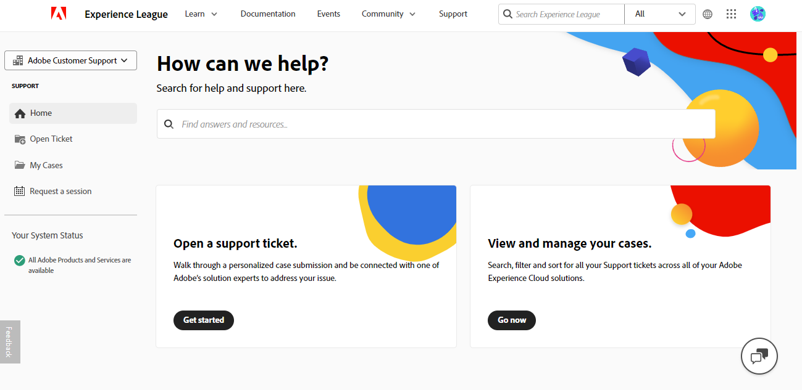

# Guía del usuario de soporte técnico de Experience League para Adobe Commerce

En esta guía, aprenderá a enviar un ticket de asistencia a [Soporte técnico para Experience League](https://experienceleague.adobe.com/home#support) y a proporcionar acceso compartido a las cuentas de Adobe Commerce.

>[!NOTE]
>
>La asistencia de Adobe Commerce ha migrado del Centro de ayuda de Adobe Commerce al Experience League. Utilice el flujo de formulario de caso de Experience League descrito [aquí](#what-is-experience-support) para enviar casos de soporte.

>[!NOTE]
>
>En este momento, para ver los casos que ha enviado anteriormente en el Centro de ayuda de Adobe Commerce, debe ir a https://support.magento.com/hc/en-us/requests, ya que estos casos no se han migrado al nuevo sistema de tickets de asistencia. El Centro de ayuda es ahora de solo lectura; para seguir recibiendo soporte técnico para el problema original, tendrá que enviar un ticket de seguimiento a [Soporte técnico para Experience League](https://experienceleague.adobe.com/home#support).

>[!NOTE]
>
>La parte de Knowledge Base del Centro de ayuda de Adobe Commerce ha migrado al portal de Adobe Experience League. Cuando cree un vale de soporte, se le sugerirán artículos de la Base de conocimiento relacionados, junto con otra documentación de Adobe Commerce relevante de Adobe Experience League.

**Actualización importante:** 29 de julio de 2024

**[¿QUÉ ES LA COMPATIBILIDAD CON EL EXPERIENCE LEAGUE?](#what-is-experience-support)**

**[CASOS DE SOPORTE TÉCNICO](#support-cases)**

* [Iniciar sesión en Soporte para Experience League](#sign-in-experience-support)
* [Envío de un caso de asistencia](#submit-case)

   * [Página de inicio de Adobe Experience League](#experience-league-start-page)
   * [página de cuenta de Adobe Commerce](#submit-case-adobe-commerce-account-page)
   * [*Verifique su dirección de correo electrónico*](#verify-email-address-error)

* [Seguimiento de los casos de asistencia](#track-support-cases)
* [Comentarios en su caso](#comments-in-your-case)
* [Cierre su caso](#close-case)
* [Vuelva a abrir el caso](#reopen-case)
* [Enviar ticket mediante la consola de Cloud](#cloud-console)
* [Línea directa de Adobe Commerce P1](#P1-hotline)
* [Modelo operativo de responsabilidad compartida de Adobe Commerce](#shared-responsibility-operational-model)

**[ACCESO COMPARTIDO: CONCEDA PRIVILEGIOS PARA QUE OTROS USUARIOS TENGAN ACCESO A SU CUENTA](#shared-access)**

* [Quién puede proporcionar acceso compartido](#who-can-provide-shared-access)
* [Proporcionar acceso compartido](#provide-shared-access)
* [Revocar (eliminar) el acceso compartido](#revoke-shared-access)

   * [¿Cómo eliminar a los usuarios a los que se les concedió acceso compartido a través de un proyecto de Cloud?](#remove-cloud-shared-access-users)

* [Acceso a una cuenta compartida (cuentas de conmutador)](#switch-accounts)
* [Solución de problemas de acceso compartido](#troubleshooting-shared-access)

**[PREGUNTAS FRECUENTES SOBRE FACTURACIÓN PARA ADOBE COMMERCE](#billing-faq)**

## ¿QUÉ ES LA ASISTENCIA DEL EXPERIENCE LEAGUE? {#what-is-experience-support}

Asistencia al Experience League es un portal de asistencia para el Adobe en el que los clientes de Adobe Commerce aptos pueden enviar y administrar vales de soporte. También es donde puede revisar los artículos de resolución de problemas.

## CASOS DE SOPORTE {#support-cases}

La administración de casos de soporte de Adobe Experience League permite trabajar con el soporte a través de casos para abordar problemas específicos encontrados al utilizar productos de Adobe, incluido Adobe Commerce, para todos los productos de Adobe Commerce bajo contrato.

## INICIAR SESIÓN EN ASISTENCIA PARA EXPERIENCE LEAGUE {#sign-in-experience-support}

El inicio de sesión le permite enviar, actualizar y responder a preguntas de los agentes en vales de soporte.

Para iniciar sesión en Soporte de Adobe Experience League, siga estos pasos:

1. Vaya a [experienceLeague.adobe.com](https://experienceleague.adobe.com/).
1. Inicie sesión con sus credenciales de inicio de sesión de Adobe.

### Envío de un caso de asistencia {#support-case}

Una vez que haya iniciado sesión correctamente como propietario de la cuenta o usuario de acceso compartido, puede enviar un caso de asistencia técnica mediante la página de inicio de Adobe Experience League, la página de la cuenta de Adobe Commerce y la página de la cuenta de Adobe Commerce Cloud.

#### Página de inicio de Adobe Experience League {#experience-league-start-page}

Para enviar un nuevo caso de asistencia técnica mediante la página de inicio de Adobe Experience League, siga estos pasos:

>[!INFO]
>
>1. Para enviar un caso, debe tener derecho a recibir asistencia para el producto correspondiente (por ejemplo, Adobe Commerce, informes de Adobe Commerce, servicios de pago de Adobe Commerce, Experience Platform, etc.). Si no tiene derecho a asistencia, aparecerá una barra en la parte superior de la página que le informará de que no es un usuario con derecho a asistencia en la organización. Para enviar un caso por problemas relacionados con Commerce, primero debe seleccionar el nombre de organización apropiado que termine en *[!DNL Commerce]*.
>1. Si pertenece a varias organizaciones o existen varias con nombres de aspecto similar (cada una representará a cualquiera de los demás productos de Adobe a los que la organización está suscrita), primero debe seleccionar la organización adecuada en el menú desplegable.
>1. Si no ve Adobe Commerce en el menú desplegable [!UICONTROL Select a product], primero debe obtener [Acceso compartido](#shared-access) del propietario de la cuenta de Commerce. Una vez que se le haya dado acceso compartido, tendrá que [sincronizar su cuenta](#switch-accounts) para finalizar el proceso antes de poder enviar un caso.

>[!NOTE]
>
>Asegúrese de haber seleccionado la organización correcta antes de enviar el caso y de que la organización seleccionada tiene los derechos adecuados para el producto para el que solicita asistencia. Por ejemplo, si su problema está relacionado con Adobe Commerce, pero ha seleccionado Experience Platform como producto y el caso se ha enviado correctamente, esto puede provocar un enrutamiento incorrecto del caso y retrasos en los tiempos de respuesta.
>
>Además, si se ha seleccionado una organización incorrecta, su equipo no podrá ver el caso en [!UICONTROL My Cases] para la organización correcta o adecuada. El equipo de asistencia no tiene la capacidad de cambiar la organización asociada con el caso en el futuro.

1. Haz clic en **Asistencia** en el encabezado. Se abrirá la página de inicio de Asistencia.

   

1. Para comenzar el proceso de admisión de asistencia, asegúrese de haber seleccionado la organización adecuada en la lista desplegable Organización (si está visible). Para enviar un caso para Adobe Commerce, seleccione el nombre de la organización que termina en *[!DNL Commerce]*.

   

1. Haga clic en **[!UICONTROL Open Ticket]** en el menú de la izquierda o haga clic en **[!UICONTROL Get Started]** en la tarjeta *[!UICONTROL Open a support ticket]*.

   

1. Seleccione un producto del menú desplegable y proporcione un título y una descripción para el caso. NOTA: Si la lista desplegable no muestra ningún producto o Commerce no es una opción disponible, pruebe a cambiar la organización en la columna izquierda y vuelva a comprobarlo.

   

1. Adobe Experience League le sugerirá artículos y prácticas recomendadas que pueden ayudarle a resolver su caso. Si todavía necesita soporte directo, deberá proporcionar información adicional antes de enviar su caso.

   

1. Una vez que haya completado toda la información requerida, haga clic en **[!UICONTROL Submit case]**.

>[!IMPORTANT]
>
>Si no puede ver su organización en el menú desplegable de la organización al iniciar sesión en experienceleague.adobe.com, es posible que tenga que sincronizar su perfil con accounts.magento.com antes de solicitar asistencia técnica o administrar un caso de asistencia existente.   
>
>1. Vaya a accounts.magento.com e inicie sesión con el mismo perfil (corporativo, escolar o personal) que utilizará para administrar los casos de asistencia en Adobe Experience League. 
>1. Una vez que haya iniciado sesión correctamente en su perfil de accounts.magento.com, vuelva a experienceleague.adobe.com e inicie sesión. 
>1. Seleccione su organización en el menú desplegable de organización. 
>1. Si su organización sigue sin aparecer, póngase en contacto con el administrador de Commerce para obtener derechos de delegado de asistencia. Para obtener más información, consulte el artículo de ayuda [Uso compartido de cuentas de Commerce](https://experienceleague.adobe.com/en/docs/commerce-admin/start/commerce-account/commerce-account-share). 

>[!NOTE]
>
>Por qué es importante la organización o el producto
>
>**Ejemplo A**: solo ha compartido el acceso a una compañía y esa compañía tiene derechos para dos productos de Adobe: Product1 y Product2.
>1. Dado que cada organización representa un producto, verá dos organizaciones en el menú desplegable, por ejemplo, OrgA-Product1 y OrgB-Product2.
>1. Si seleccionó Product = Product1 pero el problema está relacionado con Product2, el caso se redirigirá al servicio de asistencia de Product2 y habrá retrasos al transferir el caso al servicio de asistencia de Product1.
>1. Si envió el caso para OrgA-Product1 y desea revisar [!UICONTROL My Cases] para esa organización en el futuro, no lo verá si selecciona OrgA-Product2 como organización (solo tendrá que seleccionar la otra organización, en comparación con el ejemplo B).
>
>**Ejemplo B**: tiene acceso compartido a dos compañías y cada compañía solo tiene derechos para Adobe Commerce.
>1. Si ha enviado el caso para la organización A pero el problema realmente afecta a la organización B, los miembros de la organización B no podrán ver este caso en [!UICONTROL My Cases] en el futuro.
>1. Además, los miembros de la organización A podrán ver los casos de menos de [!UICONTROL My Cases] que en realidad están pensados para la organización B, lo que puede conllevar problemas de privacidad.

Debe tener una cuenta en https://account.adobe.com y https://account.magento.com para iniciar sesión en el Experience League y enviar un caso de asistencia. No podrá enviar un caso de asistencia hasta que haya iniciado sesión.

>[!NOTE]
>
>Si ya tiene una cuenta en https://account.magento.com pero no puede iniciar sesión, es posible que no se haya registrado para obtener una cuenta en https://account.adobe.com, lo cual es obligatorio a partir de agosto de 2022.
>
>Para resolver esto:
>1. Cree una cuenta en https://account.adobe.com con la misma dirección de correo electrónico en su MAG ID.
>1. Vaya a https://account.magento.com para vincular su Adobe ID con el ID de MAG.

#### página de cuenta de Adobe Commerce {#submit-case-adobe-commerce-account-page}

Para enviar un nuevo ticket de asistencia técnica utilizando la página de cuenta de Adobe Commerce, siga estos pasos:

1. Inicie sesión en su cuenta de Adobe Commerce. Consulte [instrucciones detalladas](https://experienceleague.adobe.com/docs/commerce-admin/start/commerce-account/commerce-account-create.html?lang=en#create-a-commerce-account) en nuestra guía de usuario.
1. Haga clic en la ficha **Asistencia**.

   {width="800"}

1. La página de asistencia de Adobe Experience League se carga automáticamente.
1. Seleccione **[!UICONTROL Open Ticket]** en el menú de la izquierda.
1. Rellene los campos.
1. Haga clic en **Enviar**.

#### *Compruebe su dirección de correo electrónico* error en la página de cuenta de Adobe Commerce {#verify-email-address-error}

No podrás enviar un ticket de asistencia si recibes el error Comprueba tu dirección de correo electrónico de forma similar a la que se muestra a continuación en la página [Cuenta de Adobe Commerce](https://account.magento.com/).

### Seguimiento de los casos de asistencia {#track-support-case}

Sus casos de soporte son los que usted:

* se ha enviado personalmente.
* se han agregado a como observador mediante un CC (copia de carbón).

#### Ver sus casos

Puede ver los casos que ha enviado personalmente al hacer clic en **[!UICONTROL My Cases]** en el menú de la izquierda.

#### Consulte los casos históricos en el Centro de ayuda de Adobe Commerce

Obtenga más información sobre cómo **ver sus casos históricos** en el Centro de ayuda de Adobe Commerce en [Retirada del Centro de ayuda de Adobe Commerce](https://experienceleague.adobe.com/en/docs/commerce-knowledge-base/kb/announcements/news/decommissioning-of-adobe-commerce-help-center) en nuestra Base de conocimiento de Adobe Commerce.

#### Vea sus casos observados

Puede ver los casos en los que se le ha *agregado como observador* al hacer clic en **[!UICONTROL My organization's cases]** en el menú de la izquierda.

<!-- TODO: Add image here -->

#### Búsqueda de casos

Para encontrar casos, escriba su consulta de búsqueda en el campo *[!UICONTROL Search]* y presione *intro* en el teclado.

#### Escalar sus casos

Si cree que un caso requiere más atención y ha pasado nuestro tiempo de respuesta inicial, puede escalar el caso. Para ello,

1. Haga clic en **[!UICONTROL Escalate to management]** en la parte inferior derecha del panel *[!UICONTROL Case Detail]*, en la parte derecha de la pantalla.

   

1. Después de hacer clic en, aparecerá un formulario emergente. Complete el formulario y haga clic en **[!UICONTROL Escalate]**.

   

   *Las razones para la escalación pueden incluir*: habilidades de comunicación del agente, conocimientos técnicos del agente, espera de devolución/actualización, cambio en la urgencia del problema, la resolución no cumplió con las expectativas o tiempo para la resolución.

#### Añadir un observador en los casos de asistencia

Puede agregar observadores para admitir los casos enviados por los miembros de su organización. Los observadores recibirán notificaciones por correo electrónico cuando se envíen nuevos casos o se actualicen los casos existentes.

1. Para añadir un observador a un caso existente, abra el caso y haga clic en el icono de lápiz situado junto a &quot;observadores&quot; en el panel Detalles del caso, en la parte derecha de la pantalla.

   

1. Después de hacer clic en el lápiz, puede agregar o quitar observadores de la lista.

   

### Comentarios en su caso {#comments-in-your-case}

Los comentarios de su caso contienen todos los comentarios escritos por usted o por el equipo de asistencia de Adobe Commerce. Los comentarios se muestran de los más recientes (arriba) a los más antiguos (abajo).
Para añadir un comentario, siga estos pasos:

1. Desplácese hasta la parte inferior del ticket.
1. Escriba su comentario en el campo **[!UICONTROL Comments]** y haga clic en **[!UICONTROL Add comments]**.

### Cierre su caso {#close-case}

Para cerrar el caso, haga clic en **[!UICONTROL Close case]** en la parte inferior derecha del panel *[!UICONTROL Case Detail]*.

### Vuelva a abrir el caso {#reopen-case}

Para reabrir su caso, responda al correo electrónico de nuestro sistema de asistencia relacionado con ese caso y solicite al agente que lo vuelva a abrir. Si lo hace dentro de los 14 días posteriores al cierre del caso, el agente puede reabrir el caso por usted. Sin embargo, si es después de 14 días, el agente tendrá que crear un nuevo caso.

### Enviar ticket mediante la consola de Cloud {#cloud-console}

Para enviar un nuevo ticket de asistencia técnica mediante Cloud Console, siga estos pasos:

1. Inicie sesión en [Cloud Console](https://console.adobecommerce.com).
1. Seleccione **[!UICONTROL Support]** en el menú de usuario.
1. Se carga la página **[!UICONTROL My Tickets]**.
1. Haga clic en **[!UICONTROL Submit a ticket]** en la esquina superior derecha.
1. Rellene los campos.
1. Haga clic en **Enviar**.
1. Haga clic en **[!UICONTROL Submit]**.

### Línea directa de Adobe Commerce P1 {#P1-hotline}

El artículo de la [línea directa P1 de Adobe Commerce](https://experienceleague.adobe.com/docs/commerce-knowledge-base/kb/how-to/adobe-commerce-p1-notification-hotline.html) proporciona los números de la línea directa P1 para Adobe Commerce cuando se busca ayuda durante un incidente P1 y explica qué información se debe proporcionar.

### Modelo operativo de responsabilidad compartida de Adobe Commerce {#shared-responsibility-operational-model}

Consulte el artículo sobre [Modelo operativo de responsabilidad compartida de Adobe Commerce](https://experienceleague.adobe.com/en/docs/commerce-operations/security-and-compliance/shared-responsibility#operational-responsibilities-summary),
que tiene como objetivo aclarar las responsabilidades operativas de nuestra oferta de infraestructura Pro únicamente.

### Abra un ticket de seguimiento {#follow-up}

La apertura de un ticket de seguimiento garantizará que el problema original esté vinculado al ticket de seguimiento para garantizar la continuidad.

Para abrir un ticket de seguimiento, haga clic en el vínculo &quot;*crear un ticket de seguimiento*&quot; en la parte inferior del ticket en el que desea crear un ticket de seguimiento.

## ACCESO COMPARTIDO: CONCEDA PRIVILEGIOS PARA QUE OTROS USUARIOS ACCEDAN A SU CUENTA {#shared-access}

Puede conceder acceso limitado a su cuenta a otros titulares de cuentas de Adobe Commerce. En particular, al usar la funcionalidad **acceso compartido**, puede otorgar privilegios a empleados y proveedores de servicios de confianza para que usen su cuenta del Centro de ayuda y así poder trabajar con sus tickets de soporte técnico.

Puede proporcionar y administrar el acceso compartido mediante la página de cuenta de Adobe Commerce en [https://account.magento.com](https://account.magento.com/).

### Quién puede proporcionar acceso compartido {#who-can-provide-shared-access}

Solo el propietario de la cuenta (titular de la cuenta principal) con los privilegios correspondientes puede proporcionar acceso compartido a otros usuarios.

La gestión de los usuarios y su acceso es responsabilidad del cliente, especialmente en la perspectiva del acceso compartido. Por lo tanto, el equipo de asistencia de Adobe Commerce no puede proporcionar acceso compartido a una cuenta de Adobe Commerce en nombre de un cliente. Se recomienda a los clientes que agreguen usuarios con acceso compartido mediante la [página de cuenta de Adobe Commerce](https://account.magento.com/).

Los usuarios a los que se ha proporcionado acceso compartido no pueden transferir ni conceder dicho acceso a otros usuarios.

### Proporcionar acceso compartido {#provide-shared-access}

Consulte la sección [Compartir una cuenta de Commerce](https://experienceleague.adobe.com/en/docs/commerce-admin/start/commerce-account/commerce-account-share) de la Guía de introducción de Adobe Commerce para ver los pasos detallados sobre cómo configurar una cuenta compartida.

Después de proporcionar acceso compartido a un nuevo usuario, la información relacionada estará disponible en **Acceso compartido** > **Administrar permisos** de la página de la cuenta de Adobe Commerce.

### Revocar (eliminar) el acceso compartido {#revoke-shared-access}

1. Inicie sesión en su cuenta de Adobe Commerce en [https://account.magento.com](https://account.magento.com/).
1. En el panel de la izquierda, en Acceso compartido, elija **Administrar permisos.**
1. Busque el usuario desde el que desea revocar el acceso compartido y haga clic en {width="25"} en la fila del usuario (columna **Acciones**).
1. Haga clic en **Eliminar usuario** para revocar el acceso o en X en la esquina superior para cancelar la revocación.

   {width="800"}

   También puede revocar el acceso compartido mediante el menú **Editar**:

1. Inicie sesión en su cuenta de Adobe Commerce en [https://account.magento.com](https://account.magento.com/).
1. En el panel de la izquierda, en Acceso compartido, elija **Administrar permisos.**
1. Busque el usuario desde el que desea revocar el acceso compartido y haga clic en **Editar** en la fila del usuario (columna **Acciones**).
1. Haga clic en **Eliminar este usuario** en la parte inferior de la página.
1. En el elemento emergente de confirmación, haga clic en **Eliminar usuario** para revocar el acceso o en X en la esquina superior para cancelar la revocación.

### ¿Cómo eliminar a los usuarios a los que se les concedió acceso compartido a través de un proyecto de Cloud? {#remove-cloud-shared-access-users}

<u>Productos y versiones afectados</u>

* Adobe Commerce Cloud (todas las versiones)

<u>Causa</u>

Si tiene o ha tenido un proyecto de Adobe Commerce Cloud y ha agregado un usuario al proyecto, se le habría concedido automáticamente acceso compartido en el ID de IMAGEN del propietario del proyecto. Normalmente, esto se indica en la columna **[!UICONTROL Share Name]**, que muestra *Acceso compartido en la nube desde MAG[XYZ]*.

Si falta el vínculo del DELETE, significa que el acceso compartido se concedió automáticamente mediante el Commerce Cloud.

<u>Solución</u>

No se puede eliminar la lista de usuarios de acceso compartido con el nombre compartido de *Acceso compartido de nube de MAG[XYZ]* si el acceso compartido no se agregó o proporcionó en esta página. Se conservan con fines informativos o de auditoría.

Sin embargo, una vez que haya revocado los permisos a esos usuarios de acceso compartido, ya no tendrán ese acceso.

1. Inicie sesión en su cuenta de Adobe Commerce en [https://account.magento.com](https://account.magento.com/).
1. En el panel de la izquierda, debajo de *[!UICONTROL Shared Access]*, elija **[!UICONTROL Manage Permissions]**.
1. Busque el usuario desde el que desea revocar el acceso compartido y haga clic en **[!UICONTROL Edit]** en la fila del usuario (columna *[!UICONTROL Actions]*).
1. Desmarque todos los recursos bajo *[!UICONTROL Grant Account Permissions]*.

{width="800"}

Para obtener más información, consulte la documentación de [Administrar el acceso de los usuarios](https://experienceleague.adobe.com/docs/commerce-cloud-service/user-guide/project/user-access.html#manage-users-from-the-project-web-interface) en nuestra Guía de infraestructura en la nube de Commerce.

### Acceso a una cuenta compartida (cuentas de conmutador) {#switch-accounts}

Para utilizar el acceso compartido proporcionado, siga estos pasos:

1. Inicie sesión en su cuenta de Adobe Commerce en [https://account.magento.com](https://account.magento.com/).
1. Haga clic en el menú **Cambiar cuentas** y seleccione una cuenta.

   {width="800"}

Para saber qué cuenta está usando actualmente (su propia cuenta nativa o acceso compartido), vea el menú **Cambiar cuentas**: muestra la cuenta activa.

### Solución de problemas de acceso compartido {#troubleshooting-shared-access}

Consulte el [artículo de solución de problemas con acceso compartido](/help/troubleshooting/miscellaneous/shared-access-troubleshooting.md) en nuestra base de conocimiento de asistencia.

## PREGUNTAS FRECUENTES SOBRE FACTURACIÓN PARA ADOBE COMMERCE {#billing-faq}

Los comerciantes generalmente pagan por nuestros servicios con una transacción de tarjeta de crédito (CC), y esta [Preguntas frecuentes sobre facturación para Adobe Commerce](/help/faq/general/billing-faq-for-adobe-commerce.md) es un recurso para ayudarlo cuando pague su factura.

