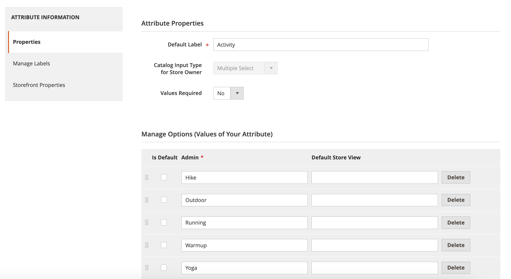

# Las facetas [!DNL Live Search] no están ordenadas alfabéticamente

## Productos y versiones afectados

Adobe Commerce versiones 2.4.x y posteriores

## Problema

Todas las facetas de tienda de Adobe Commerce se ordenan alfabéticamente con opciones de selección única, independientemente del tipo de entrada asignado al atributo correspondiente.

## Solución

Sin embargo, en algunos casos extremos, es posible que las facetas no se ordenen alfabéticamente según lo configurado en el [[!DNL Live Search] espacio de trabajo de facetas](https://experienceleague.adobe.com/es/docs/commerce-merchant-services/live-search/live-search-admin/facets/faceting-workspace).

Como solución alternativa, puede ordenar los atributos de producto en la sección de atributos [!UICONTROL Admin].

1. En la barra lateral **[!UICONTROL Admin]**, ve a **Tiendas** > *Atributos* > **Producto**.
1. Seleccione un atributo de la tabla.

   

1. Abra el atributo que tiene los valores que desea ordenar y seleccione **Información del atributo** > **Propiedades**.
1. En **Administrar opciones**, puede ordenar los valores de atributo.

   
